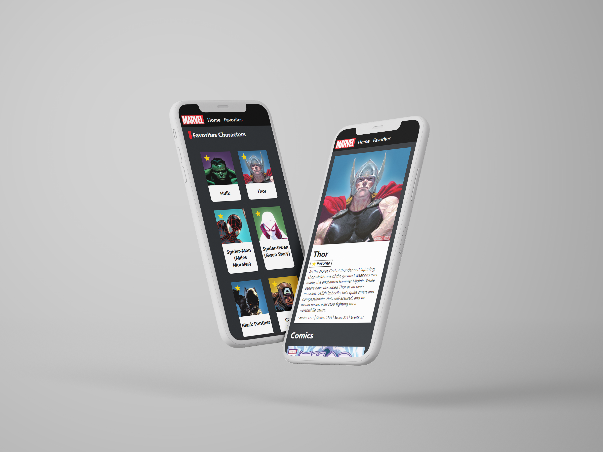

# :superhero: Marvel Characters

O Marvel Characters é um site onde é possível ver os personagens da Marvel, informações sobre eles e criar uma lista com os seus personagens favoritos.

Os dados são fornecidos  pela [API da Marvel](https://developer.marvel.com/).

O site tem uma versão de teste, que pode ser acessada pelo seguinte [link](https://marvel-characters-steel.vercel.app/).


### Funcionalidades: 

- Listar personagens
- Pesquisar pelo nome
- Ordenar a listagem
- Paginação
- Página de detalhe com informações sobre o personagem
- Listagem de personagens favoritos
- Adicionar ou remover dos favoritos
- Responsividade

### Tecnologias utilizadas
Para a construção do site, foram utilizadas as seguintes tecnologias:

- React
- JavaScript
- Styled Component
- Context API
- Local Storage
- React Testing Library
- Cypress


## :rocket: Como executar:

Para rodar o projeto é necessário ter o [Node.js](https://nodejs.org/en/) e o [Yarn](https://classic.yarnpkg.com/lang/en/docs/install/#windows-stable) instalados

Primeiro, instale as dependências do projeto:

```
yarn install
```

E para subir o projeto:

```
yarn start
```

O site ficará disponível em http://localhost:3000/


## :test_tube: Testes

Para a realização dos testes de inteface foi utilizado a blioteca [React Testing Library](https://testing-library.com/docs/react-testing-library/intro/) e para os testes de integração foi utilizado o [Cypress](https://www.cypress.io/).

Para rodar os testes:

```
yarn tests
```

Para gerar o relatório de coverage: 

```
yarn tests --coverage --watchAll=false
```
### Cypress
Para rodar os testes do cypress, é necessário estar com o servidor do projeto rodando.

Para rodar os testes do cypress pelo terminal:

```
yarn cypress run
```
Também é possível rodar os testes do cypress pela interface:

```
yarn cypress open
```
